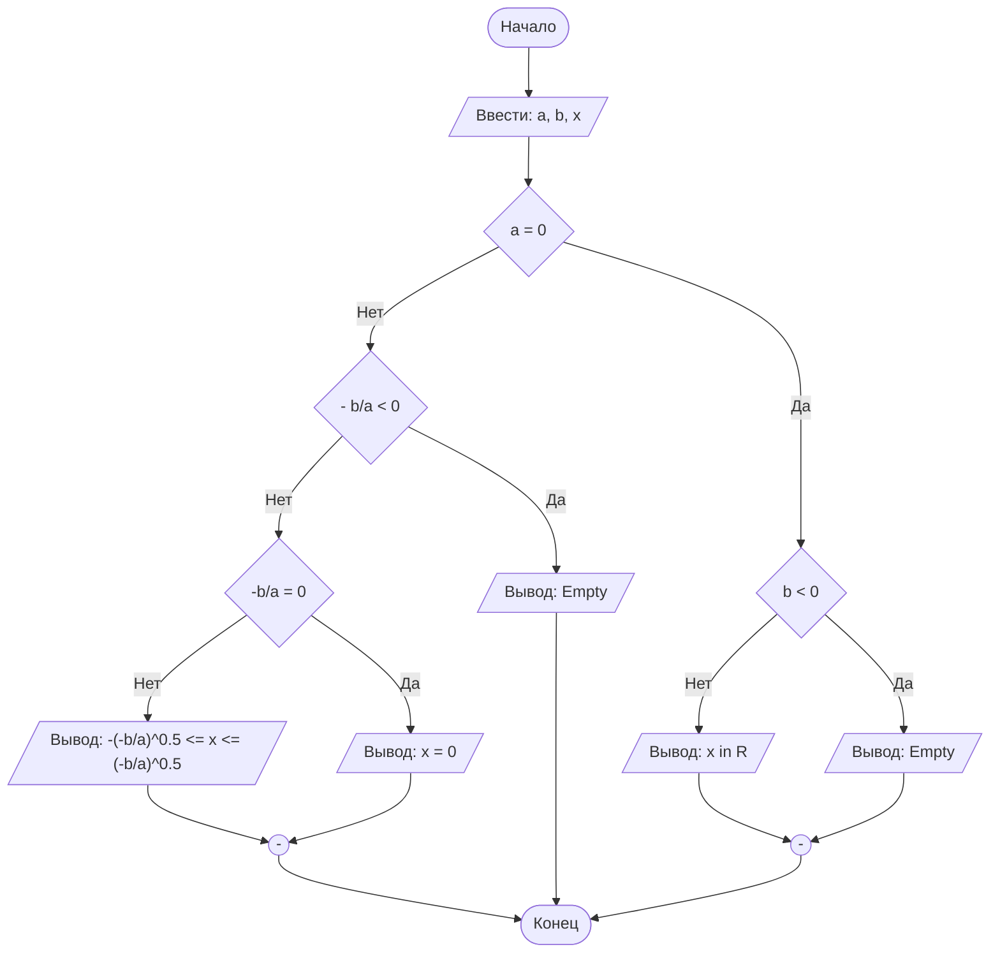

# LabN10
## Отчет по лабораторной работе № N

#### № группы: `ПМ-2401`

#### Выполнил: `Гусева Дарья Борисовна`

#### Вариант: `10`

### Cодержание:

- [Постановка задачи](#1-постановка-задачи)
- [Входные и выходные данные](#2-входные-и-выходные-данные)
- [Математическая модель](#25-математическая-модель)
- [Выбор структуры данных](#3-выбор-структуры-данных)
- [Алгоритм](#4-алгоритм)
- [Программа](#5-программа)
- [Анализ правильности решения](#6-анализ-правильности-решения)

### 1. Постановка задачи

- Условия задачи

> Три отрезка длиной A, B и C пытаются образовать треугольник. Проверить, возможно ли составить треугольник из этих отрезков, и если да, то определить, какой какой это треугольник: равносторонний, равнобедренный, разносторонний или прямоугольный. На вход программы подаются натуральные числа A, B, C.

- нам нужно определить образуют ли 3 отрезка треугольник с помощью условия неравенства сторон треугольников, и если он существует то определить его тип. для определения равностороннего нужно сравнить все три стороны, для равнобедренного две, для прямоугольного применить теорему Пифагора и если ни одно из условий не подходит, то он разносторонний

### 2. Входные и выходные данные

- на вход даются три натуральных числа, так как это стороны треугольника 
- на выход выдаётся текст с информацией о существовании треугольника и его виде при наличии

### 3. Выбор структуры данных

Анализ (рассуждения) и обоснования того, где и как Вы собираетесь хранить всё то,
что нужно для работы программы.

### 4. Алгоритм

на вход даются 3 числа 
для начала мы проверяем, является ли они сторонами треугольника. если нет, выводим 'не являются сторонами треугольника', иначе проверяем является ли наш треугольник равносторонним, сравнивая попарно каждую сторону, если да, то выводим 'равносторонний треугольник', если нет, то проверяем следующее условие и требуем чтобы хотя бы 2 стороны были равны, если условие выполняется то выводим 'равнобедренный треугольник', если нет то проверяем по теореме Пифагора каждую сторону. при соблюдении условия выводим 'прямоугольный треугольник', иначе 'разносторонний треугольник'.

```markdown
    ```mermaid
        ([Начало]) --> B[/Ввести: a, b, x/]
        B --> C{a = 0}
        C -- Нет --> D{- b/a < 0}
        D -- Нет --> E{"-b/a = 0"}
        E -- Нет --> F[/"Вывод: -(-b/a)^0.5 <= x <= (-b/a)^0.5"/]
        E -- Да --> G[/Вывод: x = 0/]
        D -- Да --> H[/Вывод: Empty/]
        C -- Да --> I{b < 0}
        I -- Нет --> J[/Вывод: x in R/]
        I -- Да --> K[/Вывод: Empty/]
        J --> M(("-"))
        K --> M
        G --> L(("-"))
        H ----> Z
        F --> L
        M --> Z
        L --> Z([Конец])
    ``` 
```




### 5. Программа

```java
import java.io.PrintStream;
import java.util.Scanner;
public class Main {
    public static void main(String[] args) {
        int a = System.in.nextInt();
        int b = System.in.nextInt();
        int c = System.in.nextInt(); //ввод с клавиатуры 3 натуральных чисел
        if (((a+b)<c)||((a+c)<b)||((b+c)<a)) { //проверка чисел на соблюдение неравенства треугольника
            System.out.println("не являются сторонами треугольника");
            break;} //выход из цикла при выполнении условия
        else { //если стороны образуют треугольник - проверяем на выполнение дальнейших условий
            if ((a==b)&&(b==c)&&(a==c)) { //проверка всех сторон на одновременное равенство
                System.out.println("треугольник равносторонний");
                break;}
            else {
                if ((a==b)||(b==c)||(a==c)) { //проверка сторон на наличие равенства у двух любых сторон
                    System.out.println("треугольник равнобедренный");
                    break;}
                else {
                    if (((a*a+b*b)==c*c)||((c*c+b*b)==a*a)||((a*a+c*c)==b*b)) { //проверка сторон на соблюдение теоремы пифагора
                        System.out.println("треугольник прямоугольный");
                        break;}
                    else { //при несоблюдении ни одного из условий
                        System.out.println("треугольник разносторонний");
                    }
                }
            }
        }
    }
}
```

### 6. Анализ правильности решения

1. Тест на определение существования треугольника

- Input:
    ```
    2
    3
    7
    ```

- Output:
    ```
    не являются сторонами треугольника
    ```

2. Тест на равносторонний треугольник

- Input:
    ```
    5
    5
    5
    ```

- Output:
    ```
    треугольник равносторонний
    ```
3. Тест на равнобедренный треугольник

- Input:
    ```
    5
    5
    7
    ```

- Output:
    ```
    треугольник равнобедренный
    ```
4. Тест на прямоугольный треугольник

- Input:
    ```
    3
    4
    5
    ```

- Output:
    ```
    треугольник прямоугольный
    ```
5. Тест на разносторонний треугольник

- Input:
    ```
    5
    7
    8
    ```

- Output:
    ```
    треугольник разносторонний
    ```

